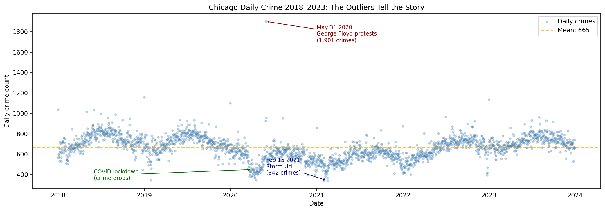
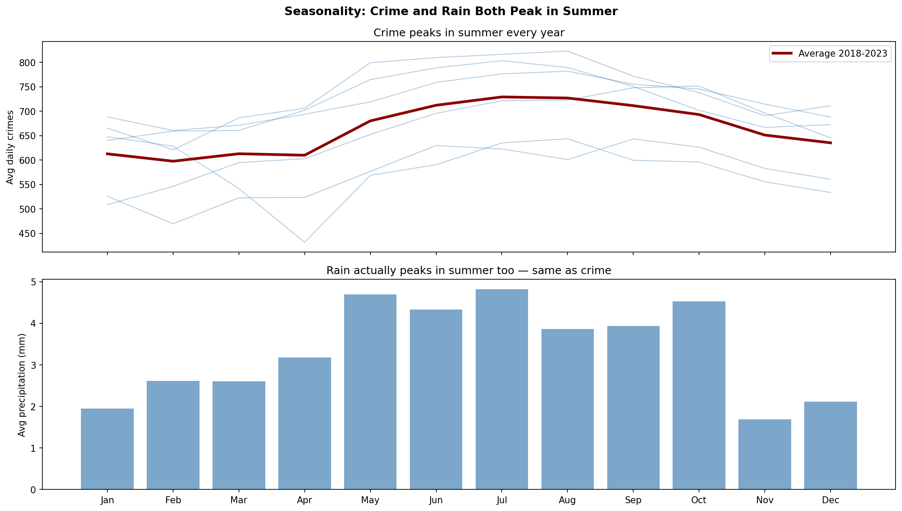
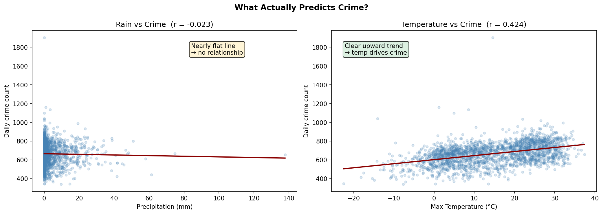
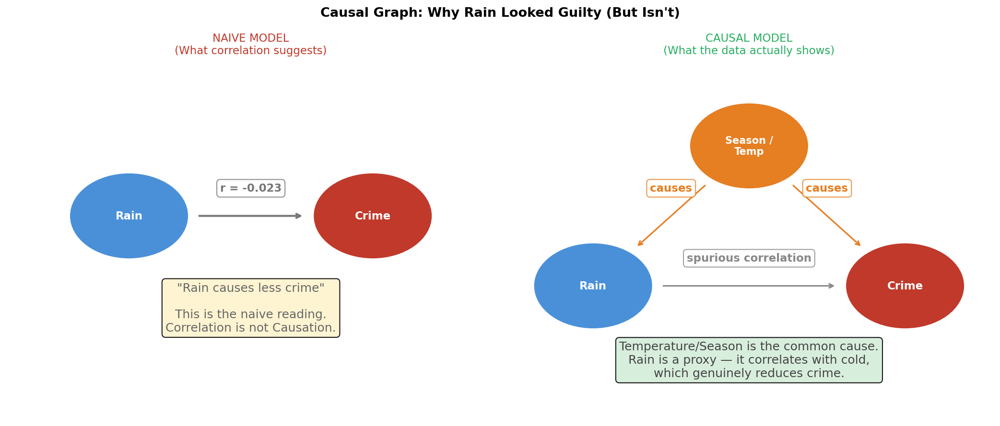
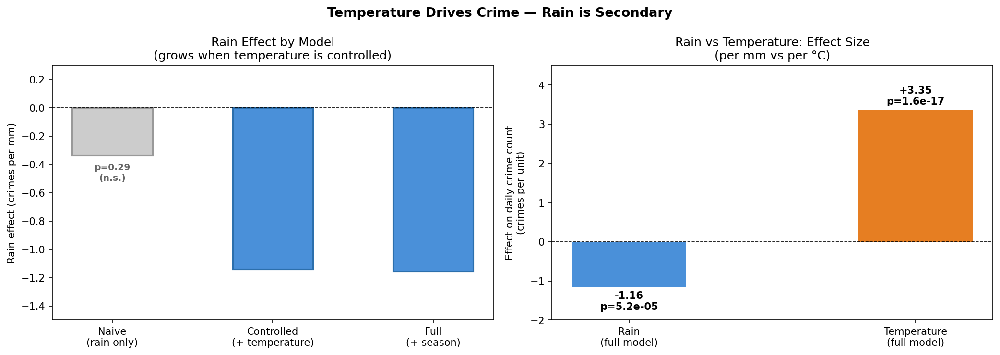

# Data Confessions
### Does Rain Reduce Crime? A Multi-Agent Causal Analysis System

A multi-agent AI system that investigates whether rainfall causally reduces crime 
in Chicago, using LangGraph for agent orchestration and Claude as the reasoning engine.

Inspired by *Everybody Lies* (Seth Stephens-Davidowitz) and 
*The Book of Why* (Judea Pearl).

---

## The Question

Folk wisdom says criminals stay home when it rains. But is that actually true — 
or is it a statistical illusion created by confounding variables?

This project builds a multi-agent AI system to investigate that question rigorously, 
using 6 years of Chicago crime and weather data (2,191 days, 1.4M crime records).

**The confession:** Temperature drives crime. Rain is secondary — and you would 
never see its real effect without controlling for temperature first.

---

## Agent Architecture
```
User Question
│
▼
┌─────────────────┐
│   Investigator  │  → explores data, identifies patterns, flags outliers
└────────┬────────┘
│
▼
┌─────────────────┐
│  Statistician   │  → correlations, regressions, effect sizes
└────────┬────────┘
│
▼
┌─────────────────┐
│ Causal Analyst  │  → confounders, DAGs, suppression effects
└────────┬────────┘
│
▼
┌─────────────────┐
│     Skeptic     │  → challenges conclusions, flags limitations
└────────┬────────┘
│
▼
┌─────────────────┐
│    Reporter     │  → final report in plain language
└─────────────────┘
```
Each agent receives the full outputs of all previous agents, building 
a cumulative analysis where each perspective informs the next.

---

## Key Findings

| Model | Rain effect | Rain p-value | R² |
|-------|-------------|--------------|-----|
| Naive (rain only) | -0.338 crimes/mm | p=0.287 (not significant) | 0.0005 |
| Controlled (+ temperature) | -1.139 crimes/mm | p=8.16e-05 | 0.185 |
| Full (+ season) | -1.157 crimes/mm | p=5.24e-05 | 0.213 |

- **Temperature p-value: 2.41e-99** — every °C increase adds ~3.4 crimes/day
- **Rain effect:** real but modest — ~1.2 fewer crimes per mm, only visible after controlling for temperature
- **Suppression effect:** naive correlation (r=-0.023) was non-significant; temperature was masking rain's true signal

---

## Screenshots

### Chicago Crime Timeline 2018–2023
*Outliers reveal the real story — Storm Uri and George Floyd protests*


### Seasonality: Crime and Rain Both Peak in Summer
*The hidden confounder — seasonal patterns drive both variables*


### What Actually Predicts Crime?
*Rain (r=-0.023) vs Temperature (r=0.424) — 18x stronger signal*


### Causal Graph: Why Rain Looked Guilty
*Classic suppression effect — temperature is the common cause*


### Final Verdict: Temperature Drives Crime
*Rain effect grows when controlled — but temperature dominates*


---

## Project Structure
```
data-confessions/
├── data/
│   └── raw/                    # crime.csv + weather.csv (not tracked in git)
├── src/
│   ├── agents/                 # individual agent modules (coming soon)
│   ├── tools/
│   │   └── data_loader.py      # loads and merges crime + weather data
│   ├── graph.py                # LangGraph multi-agent orchestration
│   └── prompts.py              # system prompts for each agent
├── notebooks/
│   └── exploration.ipynb       # full causal analysis with visualizations
├── docs/
│   └── screenshots/            # figures for README
├── app.py                      # Streamlit UI (coming soon)
├── requirements.txt
└── README.md
```
---

## Data Sources

### Crime Data
- **Source:** City of Chicago Data Portal
- **URL:** https://data.cityofchicago.org/Public-Safety/Crimes-2001-to-Present/ijzp-q8t2
- **Method:** Downloaded via API by year (2018–2023)
- **Size:** 1,456,796 records → aggregated to 2,191 daily counts
- **Fields used:** date, primary_type, arrest, domestic

### Weather Data
- **Source:** Open-Meteo Historical Weather API
- **URL:** https://open-meteo.com/en/docs/historical-weather-api
- **Method:** Downloaded manually via web interface
- **Parameters:** Chicago, IL (41.85°N, 87.65°W) | 2018-01-01 to 2023-12-31 | America/Chicago
- **Variables:** Precipitation Sum, Rain Sum, Max Temperature, Min Temperature

---

## Setup

```bash
# Clone and activate environment
git clone https://github.com/KelyNorel/data-confessions.git
cd data-confessions
python -m venv venv
source venv/bin/activate
pip install -r requirements.txt

# Add your Anthropic API key
echo "ANTHROPIC_API_KEY=your_key_here" > .env

# Download data manually (see Data Sources above)
# Save as data/raw/crime.csv and data/raw/weather.csv

# Run the multi-agent analysis
python src/graph.py

# Explore the notebook
jupyter notebook notebooks/exploration.ipynb
```

---

## Stack

- **LangGraph** — multi-agent workflow orchestration
- **Claude Sonnet (Anthropic)** — reasoning engine for all 5 agents
- **statsmodels** — OLS regression, causal modeling
- **pandas, scipy** — data processing and statistical analysis
- **matplotlib** — visualizations
- **Streamlit** — interactive UI (coming soon)
- **Python 3.11**

---

## Key Design Decisions

| Decision | Choice | Rationale |
|----------|--------|-----------|
| Agent framework | LangGraph | Explicit state management — each agent's output is tracked and passed forward cleanly |
| Sequential pipeline | Linear graph | Each agent builds on previous findings; Skeptic cannot exist without Causal Analyst's conclusions |
| Data aggregation | Daily level | Matches weather data granularity; sufficient for causal analysis |
| 3 regression models | Naive → controlled → full | Demonstrates suppression effect step by step |
| Causal framing | DAG + do-calculus intuition | Inspired by Pearl's framework; distinguishes correlation from intervention |

---

**Author:** Raquel (Kely) Norel, PhD  
**Domain:** Causal Inference / Data Science / Agentic AI  
**Status:** Analysis complete | Streamlit UI coming soon
